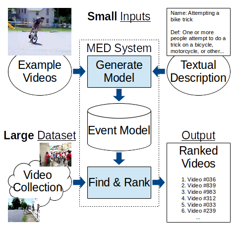

# MED for CREST-Deep

This repository contains code for developing a system of MED(Multimedia Event Detection).

The code is only for the research purpose within CREST-Deep.
You can download the code and do your own experiments freely.

The required data for developing the system is located in Tsubame.
For the detailed information of accessing the data, please refer to `Part I: Data`.

If you have any questions or requirements, please do not hesitate to contact us under `mengxi at ks.cs.titech.ac.jp`, `ryamamot at ks.cs.titech.ac.jp`.

-------------------------------------- 
CONTENT:
-------------------------------------- 
Part 0: Introduction to MED

Part I: Data

Part II: Evaluation

Part III: System Overview

Part IV: Frame Extraction

Part V: Deep Feature Extraction

Part VI: SVM Training and Testing

Part VII: LSTM Training and Testing

-------------------------------------- 
Part 0: Introduction to MED
-------------------------------------- 
_MED: Multimedia event detection_ is one task of [_TRECVID_](http://trecvid.nist.gov/): a large scale video information search and retrieval workshop hosted by NIST.
> Video is becoming a new means of documenting everything from recipes to how to change a tire of a car. Ever expanding multimedia video content necessitates development of new technologies for retrieving relevant videos based solely on the audio and visual content of the video. Participating MED teams will create a system that quickly finds events in a large collection of search videos.
-- http://www-nlpir.nist.gov/projects/tv2016/tv2016.html#med

#### MED System Overview


In this task, a system should find and rank videos including specified event from a large collection of videos.
The event is specified with a textual description and a small number of example videos.

In contrast to event recognition, videos in the large collection may contain no or multiple events.


-------------------------------------- 
Part I: Data
--------------------------------------
Basically, we are required to use given training video data to construct a system that is able to judge whether an unknown video clip contains the following events:


__20 Events for Classification__

| Event ID | Event Name                         |
|----------|------------------------------------|
| E021     | Attempting_a_bike_trick            | 
| E022     | Cleaning_an_appliance              |
| E023     | Dog_show                           |
| E024     | Giving_directions_to_a_location    |
| E025     | Marriage_proposal                  |
| E026     | Renovating_a_home                  |
| E027     | Rock_climbing                      |
| E028     | Town_hall_meeting                  |
| E029     | Winning_a_race_without_a_vehicle   |
| E030     | Working_on_a_metal_crafts_project  |
| E031     | Beekeeping                         |
| E032     | Wedding_shower                     |
| E033     | Non-motorized_vehicle_repair       |
| E034     | Fixing_musical_instrument          |
| E035     | Horse_riding_competition           |
| E036     | Felling_a_tree                     |
| E037     | Parking_a_vehicle                  | 
| E038     | Playing_fetch                      |
| E039     | Tailgating                         |
| E040     | Tuning_musical_instrument          |

It is possible that a video clip contains not any events listed above.
For the detailed description of each event, please refer to ***.

We place all the data needed for each module's input in Tsubame under the directory: 
```
	/work1/t2g-crest-deep/ShinodaLab/
```

The whole data is split into six parts: 
```
	LDC2011E41_TEST(32060 videos) 
	LDC2012E01(2000 videos)
	LDC2012E110(10899 videos) 
	LDC2013E115(1496 videos)
	LDC2013E56(242 videos)
	LDC2014E16(254 videos)
```

The parts that are involved in training are: 
```
	LDC2011E41_TEST(portions of videos)
	LDC2012E01
	LDC2013E115
```
The parts that are involved in testing are: 
```
	LDC2011E41_TEST(portions of videos) 
	LDC2012E110 
	LDC2013E56 
	LDC2014E16
```

The detailed split information for training and testing is contained in the `csv`/`txt` annotation files. They are located in: 
```
	/work1/t2g-crest-deep/ShinodaLab/annotations
```
For the detailed explanations of the annotations in `csv` and `txt`, please refer to the `Evaluation` part.

-	Video Data (Input for Frame Extraction)

	The video data is located in
```
	/work1/t2g-crest-deep/ShinodaLab/video
```
	They are compressed with H.264 and stored in .mp4 format.
-	Frame Data (Input for Deep Feature Extraction)

	The frame data is located in
```
	/work1/t2g-crest-deep/ShinodaLab/frame
```
	The frame meta is located in
```
	/work1/t2g-crest-deep/ShinodaLab/frameMeta
```
	The frame meta includes checksum and urls of the dataset videos. It is needed by the program in Deep Feature Extraction.

-	Feature Data (Input for SVM and LSTM)

	The feature data is located in
```
	/work1/t2g-crest-deep/ShinodaLab/feature
```
	We provide two kinds of features, i.e. `avgFeature` and `perFrameFeature`. 

	`avgFeature` is one-vector feature for one video. It is calculated by taking the average over the deep features of the frames within the video.

	`perFrameFeature` contains multiple feature vectors for one video. Each feature vector corresponds to one frame in the video. `perFrameFeature` is stored under the h5 format, and every row in the h5 file is one vector corresponding to one frame. The order of the vectors follows the order of the time, i.e. the first row corresponds to the first frame, the second row corresponds to the second frame...

-	Model Data(The trained models)

	The trained neural networks are located in
```
	/work1/t2g-crest-deep/ShinodaLab/models
```
	We place the caffe models under
```
	/work1/t2g-crest-deep/ShinodaLab/models/caffeModels
```
	and the torch models under
```
	/work1/t2g-crest-deep/ShinodaLab/models/torchModels
```

	The Deep Feature Extraction Module requires `googLeNet` of caffe, which is located in
```
	/work1/t2g-crest-deep/ShinodaLab/models/caffeModels/imageShuffleNet
```

-------------------------------------- 
Part II: Evaluation
-------------------------------------- 
https://www.nist.gov/sites/default/files/documents/itl/iad/mig/MED16_Evaluation_Plan_V1.pdf

The performance of the system is evaluated using mAP (mean Average Precision).

Average Precision is often used for measuring the performance of an information retrieval system.

For a given target event, the testing video clips are listed from top to bottom according to their relevance scores with respect to the target event, which are given by the system.

From that list, we are able to calculate the precisions and recalls in different cut-off thresholds of the list. Then the Average Precision is calculated as the size of the area under the P-R (Precision-Recall) curve. 


In practice, we approximate the area under the P-R curve using the following formula:
```
	AP = (1 / n) * (sum_k_from_1_to_n precision(k)),
```
where `n` is the number of target videos in the testing dataset, `precision(k)` is the precision of the retrieval list that is cut off at the point where `k` target videos are just included.

Finally, mAP is calculated by taking the average of APs over all the events, which is used as the measurement of the system.

`TRECVID` provides us the video information and annotations for training and testing in `csv` form:


`EVENTS-BG_20160701_ClipMD.csv` provides information about the background videos for training. These videos contain not any 20 target events.


`EVENTS-PS-100Ex_20160701_JudgementMD.csv` provides annotations of positive and hard-negative video clips for training. Each row corresponds to a video, presenting the video `ClipID`, `EventID` and `Instance_type`. `positive` in the `Instance_type` indicates the video is positive, while `miss` indicates the video is hard-negative.


`Kindred14-Test_20140428_ClipMD.csv` provides information about the testing videos.


`Kindred14-Test_20140428_Ref.csv` provides annotations of the testing videos. Each row corresponds to a video-event combination, indicating whether the video contains the event. For example, `"000069.E029","n"` means the video `000069` contains no event of `E029`, while `"996867.E037","y"` means the video `996867` contains event of `E037`.


`Kindred14-Test_20140428_EventDB.csv` provides the correspondence information of eventIds and eventNames.


In addition to the above annotation files, we generate `txt` version ones for convenience to use in codes related to training an RNN network. For the detailed explanation of the `txt` annotations, please refer to `AnnotationProcess` in `Part VII: LSTM Training and Testing`. 

-------------------------------------- 
Part III: System Overview
-------------------------------------- 

The whole system mainly consists of four modules, namely `Frame Extraction`, `Deep Feature Extraction`, `SVM Training and Testing` and `LSTM Training and Testing`. Please refer to the following figure to understand the relations among these modules.


-	Frame Extraction: 
	This module extracts frame images from videos. The input is directory containing videos and list of videos (optional). The output is directory containing png images of video frames every 2 seconds.

-	Deep Feature Extraction:
	This module is for extracting the deep features from video frames. The input is the frames extracted from videos, and the output is the corresponding features. We use `googLeNet` in the baseline code, though it is possible to easily switch to the other CNN.

-	SVM Training and Testing:
	This module will train and test SVM with deep features. The input is the annotations for training and testing data and averaged deep feature over a video. The output is detection results and average precision of the system.

-	LSTM Training and Testing:
	This module aims to build an LSTM-based RNN for detecting events. The input is the features extracted from frames, and the output is an LSTM-based RNN model(training phase), or detection results(testing phase).

You can start your experiments from any module in this pileline, since we have prepared the processed data for each module's input in Tsubame. For the access of the data, please refer to `Part I: Data`.

-------------------------------------- 
Part IV: Frame Extraction
--------------------------------------
This module extracts frame images from videos. The input is directory containing videos and list of videos (optional). The output is directory containing png images of video frames every 2 seconds.

### Requirements
- **ffmpeg** - to extract frames from videos  
	https://ffmpeg.org/  
	Binaries stored in `/work1/t2g-crest-deep/ShinodaLab/library/ffmpeg-3.2.4/bin/`

### Settings
- `videodir` - (required) directory of videos

	Video files should be placed as following format:
```bash
	${videodir}/${videoname}.mp4
```
- `outdir` - (required) directory of frames

	Frames will be output with names following format:
```bash
	${outdir}/${videoname}/${videoname}_00000001.png
	${outdir}/${videoname}/${videoname}_00000002.png
```
- `list` - (optional) list of videos

	This file should contain only file names but not paths as follows:
```bash
	hoge.mp4
	fuga.mp4
```  
	if `list` is not specified, every .mp4 files under `videodir` will be processed.

### Run
```bash
./extractFrames.sh
```

-------------------------------------- 
Part V: Deep Feature Extraction
--------------------------------------
This module is for extracting the deep features from video frames. The input is the frames extracted from videos, and the output is the corresponding features.

This module is written in Python and depends on:
```
-	Python 2.7
-	Caffe
```
You can easily import these dependencies by excuting the following if you are in Tsubame:
```
	source /usr/apps.sp3/nosupport/gsic/env/caffe-0.13.sh
	source /usr/apps.sp3/nosupport/gsic/env/python-2.7.7.sh
```

To run the code for extracting the features, please edit the variables in 'extractDeepFeaturesStarter.sh', and run:
```
	./extractDeepFeaturesStarter.sh
```
It will extract deep features of `avgFeature` and `perFrameFeature`. For the explanation of `avgFeature` and `perFrameFeature`, please refer to `Part I: Data`.

Please refer to the script `extractDeepFeaturesStarter.sh` for the configuration of variables.

__Note__: Now the code only supports extracting the deep feature from the `pool5/7x7_s1` layer of `googLeNet`.

-------------------------------------- 
Part VI: SVM Training and Testing
--------------------------------------
This module will train and test SVM with deep features. The input is the annotations for training and testing data and averaged deep feature over a video. The output is detection results and average precision of the system.

### Requirements
- **libsvm** - to train and test SVM  
	https://www.csie.ntu.edu.tw/~cjlin/libsvm/  
	Binaries stored in `/work1/t2g-crest-deep/ShinodaLab/library/libsvm-3.22/`

### Settings
- `EXPID` - (required) name of the experiment
- `TempOutDir` - (required) temporally directory
- `LIBSVM` - (required) Location of LIBSVM
- `IS_LINEAR` - (required) SVM kernel type
  - 0 - Use RBF kernel
  - 1 - Use linear kernel
- `SVSUFFIX` - (required) suffix of feature file name
- `ANNOT_DIR` - (required) directory where annotation files are saved
- `TEST_DATA` - (required) prefix of annotation files for testing
- `BG_DATA` - (required) prefix of annotation files for training back-ground data
- `TRAIN_DATA` - (required) prefix of annotation files for training positive data
- `TEST_SVDIR` - (required) directories where feature files for testing are saved
- `TRAIN_SVDIR` - (required) directories where feature files for training are saved

### Run
```bash
./svm.sh
```

### Outputs
- `${EXPID}/${EXPID}.detection.csv` - detection results
- `${EXPID}/ap.csv` - average precision and their mean

You are expected to get mAP `0.512` on the test set.

-------------------------------------- 
Part VII: LSTM Training and Testing
--------------------------------------
This module aims to build an LSTM-based RNN for detecting events. The input is the features extracted from frames, and the output is an LSTM-based RNN model (training phase), or detection results (testing phase).

This module is divided into three parts: `AnnotationProcess`, `Lstm` and `ResultEvaluate`.

`AnnotationProcess` processes the `csv` annotations and convert them into `txt` annotations, which are used as a part of input in `Lstm`. 

`AnnotationProcess` is written in C/C++ and depends on:
```
-	boost-1.58.0
``` 

To compile the C/C++ code of `AnnotationProcess`, simply change the variables in `compile.sh` to choose an appropriate C++ compiler and run:
```
	./compile.sh
```
It will give you an excutable `convertCsvToTxt`.

Editing the variables in the script `convertCsvToTxt.sh` and running:
```
	./convertCsvToTxt.sh
```
will give you the `txt` annotations in the place that you specify in the script.

Each row in the `txt` annotation file corresponds to a video clip. It includes the path of the feature of the video and a label index ranging from `[1, 21]`. `[1, 20]` corresponds to the eventID from `E21` to `E40`, and `21` corresponds to the `background` label indicating not any target events are included.

`Lstm` is written in Lua and depends on:
```
-	Torch
```
We have installed the `Torch` framework under:
```
	/work1/t2g-crest-deep/ShinodaLab/library/torch/distro
```
If you are in Tsubame, you can easily import the framework into your environment by executing:
```
	/work1/t2g-crest-deep/ShinodaLab/library/env/torch.sh
```

To train your own LSTM model, simply edit the variables in `trainStarter.sh` and run:
```
	./trainStarter.sh
```
You can find your trained models in the place that you specify in the script `trainStarter.sh`, after the trainining process completes.

To use your trained LSTM model for testing, edit the variables in `testStarter.sh` and run:
```
	./testStarter.sh
```
It will give you the detection results stored under `h5` form in the place that you specify in the script.

`ResultEvaluate` is written in Python and bash. It depends on:
```
- Python 2.7
```

To get the final AP (Average Precision) for the detection result, edit the variables in the script `evaluateStarter.sh` and run:
```
	./evaluateStarter.sh
```
The AP performance will be written to the place that you specify in the script.

Using the following parameters for training the Lstm, you are expected to get mAP `0.42` on the test set.
```
	EPOCH_NUM = 75
	BATCH_SIZE = 5
	HIDDEN_UNIT=256
	LEARNING_RATE = 0.005
	LEARNING_RATE_DECAY = 1E-4
	WEIGHT_DECAY = 0.005
	MOMENTUM = 0.9
```


